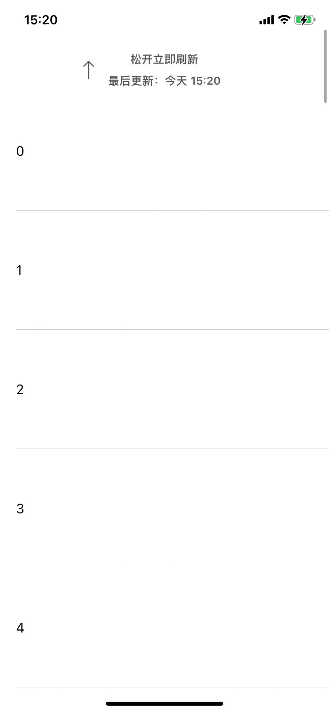

# WWPreloadService

## About

低侵入列表预加载方案，同时支持 UITableView 和 UICollectionView 。

## Usage

```objc
#import "UITableView+Preload.h"
#import "UICollectionView+Preload.h" // or
```

```objc
__weak typeof(self) weakSelf = self;
self.tableView.preloadBlock = ^{
    [weakSelf loadMoreData];
};
```

## Demo

<div align="center">
	
</div>
